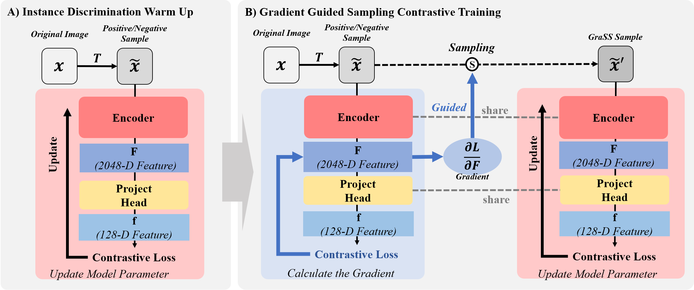

# GraSS

## GraSS: Contrastive Learning with Gradient Guided Sampling Strategy for Remote Sensing Image Semantic Segmentation

This is a PyTorch implementation of [GraSS](https://arxiv.org/abs/2306.15868) which has been published in IEEE Trans. on Geoscience and Remote Sensing.



## Abstract

<p align="justify">
Self-supervised contrastive learning (SSCL) has achieved significant milestones in remote sensing image (RSI) understanding. Its essence lies in designing an unsupervised instance discrimination pretext task to extract image features from a large number of unlabeled images that are beneficial for downstream tasks. However, existing instance discrimination-based SSCL suffer from two limitations when applied to the RSI semantic segmentation task: 1) Positive sample confounding issue; 2) Feature adaptation bias. In this study, We observed that the discrimination information can be mapped to specific regions in RSI through the gradient of unsupervised contrastive loss, these specific regions tend to contain singular ground objects. Based on this, we propose contrastive learning with Gradient gradient-guided Sampling Strategy (GraSS) for RSI semantic segmentation. GraSS consists of two stages: Instance Discrimination warm-up (ID warm-up) and Gradient guided Sampling contrastive training (GS training). The ID warm-up aims to provide initial discrimination information to the contrastive loss gradients. The GS training stage aims to utilize the discrimination information contained in the contrastive loss gradients and adaptively select regions in RSI patches that contain more singular ground objects, in order to construct new positive and negative samples. Experimental results on three open datasets demonstrate that GraSS effectively enhances the performance of SSCL in high-resolution RSI semantic segmentation. Compared to seven baseline methods from five different types of SSCL, GraSS achieves an average improvement of 1.57\% and a maximum improvement of 3.58\% in terms of mean intersection over the union.

## Self-supervised Pretraining and RSI Semantic Segmentation
### 1. Installation
Plese refer to [INSTALL.md](docs/INSTALL.md) for installation and dataset preparation.
 
### 2. Data Set

There are two ways to set data config:

a) Move to [grass_1gpu_resnet_b256.yaml](configs/config/pretrain/GraSS/grass_1gpu_resnet_b256.yaml) and change DATASET_NAMES to (e.g. Potsdam):
```
DATASET_NAMES: ["loveda_urban"] # change dataset name here
```
and training with this config ([grass_1gpu_resnet_b256.yaml](configs/config/pretrain/GraSS/grass_1gpu_resnet_b256.yaml))
```
python tools/run_distributed_engines.py config=pretrain/GraSS/grass_1gpu_resnet_b256.yaml
```
b) Execute directly without modifying the configuration file:
```
python tools/run_distributed_engines.py config=pretrain/GraSS/grass_1gpu_resnet_b256.yaml \
config.DATA.TRAIN.DATASET_NAMES=["loveda_urban"]
```

### 3. Other Config

All settings of GraSS can be set in [grass_1gpu_resnet_b256.yaml](configs/config/pretrain/GraSS/grass_1gpu_resnet_b256.yaml), including data augumentation, training epoch, optimizer, adn hyperparameters, etc.


### 4. Training 

```bash
python tools/run_distributed_engines.py config=pretrain/GraSS/grass_1gpu_resnet_b256.yaml
```


## Acknowledgement

We would like to thank the [VISSL](https://github.com/facebookresearch/vissl) and [MMSegmentation](https://github.com/open-mmlab/mmsegmentation) for its open-source project.

## Citation

If our repo is useful to you, please cite our published paper as follow:
```
Bibtex
@article{grass2023,
    title={GraSS: Contrastive Learning with Gradient Guided Sampling Strategy for Remote Sensing Image Semantic Segmentation},
    author={Zhang, Zhaoyang and Ren, Zhen and Tao, Chao and Zhang, Yunsheng and Peng, Chengli and Li, Haifeng},
    journal={IEEE Transactions on Geoscience and Remote Sensing},
    DOI = {10.1109/TGRS.2023.3336285},
    year={2023},
    type = {Journal Article}
}

Endnote
%0 Journal Article
%A Zhang, Zhaoyang
%A Ren, Zhen
%A Tao, Chao
%A Zhang, Yunsheng
%A Peng, Chengli
%A Li, Haifeng
%D 2023
%T GraSS: Contrastive Learning with Gradient Guided Sampling Strategy for Remote Sensing Image Semantic Segmentation
%B IEEE Transactions on Geoscience and Remote Sensing
%R DOI:10.1109/TGRS.2023.3336285
%! GraSS: Contrastive Learning with Gradient Guided Sampling Strategy for Remote Sensing Image Semantic Segmentation
```
